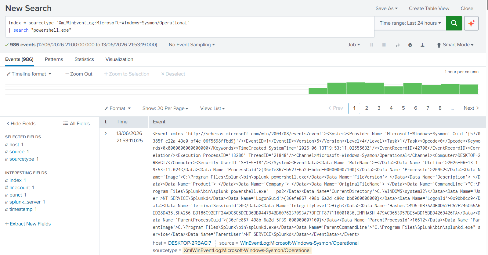
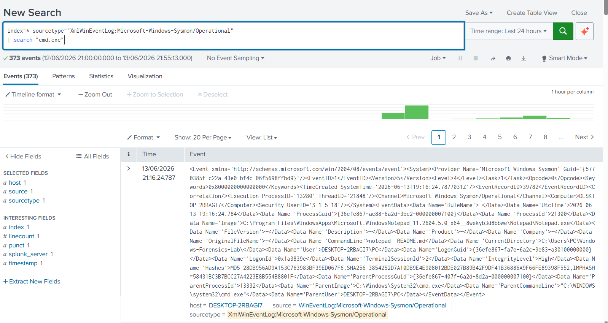
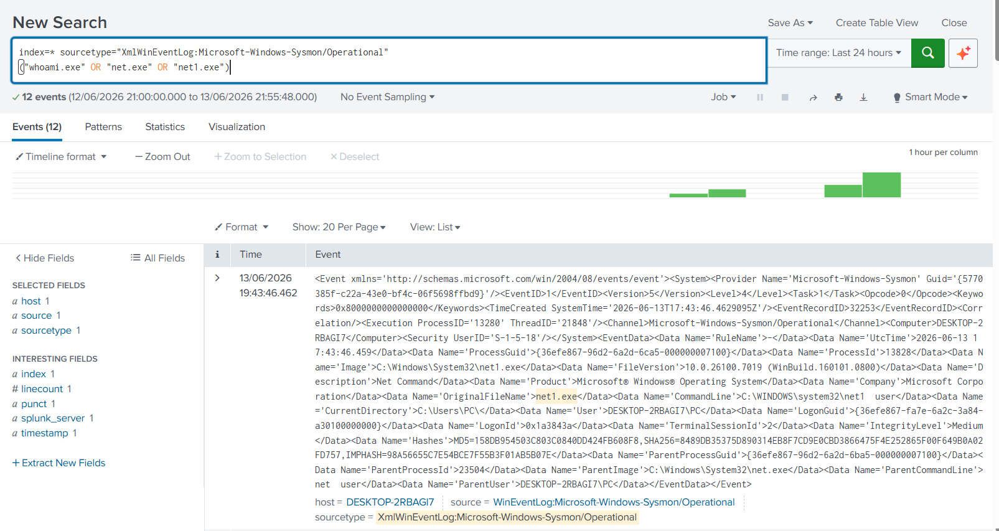
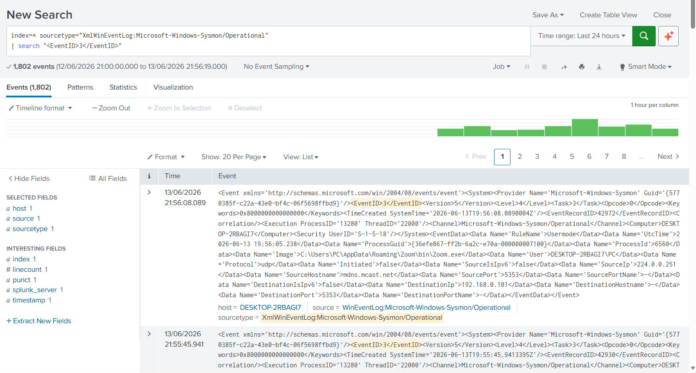
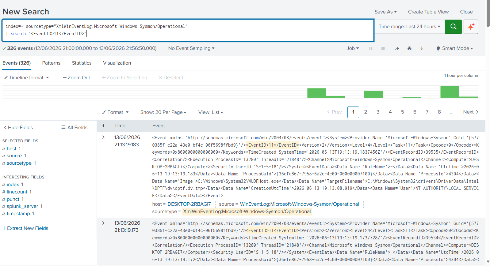

# Windows Forensics Lab

## Overview

This project demonstrates basic Windows forensic investigation using Splunk Enterprise and Sysmon telemetry.

The goal of this lab is to analyze endpoint activity, identify process execution, investigate user activity, review network connections, analyze file creation events, and build a forensic timeline.

---

## Environment

| Component  | Details                              |
| ---------- | ------------------------------------ |
| SIEM       | Splunk Enterprise 10.4               |
| Endpoint   | Windows 11                           |
| Telemetry  | Sysmon                               |
| Log Source | Microsoft-Windows-Sysmon/Operational |
| Framework  | MITRE ATT&CK                         |

---

## Investigation Objectives

* Analyze process execution activity
* Review PowerShell and command shell usage
* Investigate account discovery activity
* Review network connections
* Analyze file creation events
* Build a forensic timeline

---

## 1. Process Analysis

### Objective

Identify PowerShell execution activity on the endpoint.

### SPL Query

```spl
index=* sourcetype="XmlWinEventLog:Microsoft-Windows-Sysmon/Operational"
| search "powershell.exe"
```

### Evidence



---

## 2. Command Shell Analysis

### Objective

Review command prompt activity that may indicate manual execution or attacker interaction.

### SPL Query

```spl
index=* sourcetype="XmlWinEventLog:Microsoft-Windows-Sysmon/Operational"
| search "cmd.exe"
```

### Evidence



---

## 3. Account Discovery Analysis

### Objective

Identify account enumeration and discovery activity.

### SPL Query

```spl
index=* sourcetype="XmlWinEventLog:Microsoft-Windows-Sysmon/Operational"
("whoami.exe" OR "net.exe" OR "net1.exe")
```

### Evidence



---

## 4. Network Activity Analysis

### Objective

Review network connection events generated by Sysmon.

### SPL Query

```spl
index=* sourcetype="XmlWinEventLog:Microsoft-Windows-Sysmon/Operational"
| search "<EventID>3</EventID>"
```

### Evidence



---

## 5. File Creation Analysis

### Objective

Review file creation events that may indicate payload staging or persistence.

### SPL Query

```spl
index=* sourcetype="XmlWinEventLog:Microsoft-Windows-Sysmon/Operational"
| search "<EventID>11</EventID>"
```

### Evidence



---

## Forensic Timeline

| Time | Activity                             |
| ---- | ------------------------------------ |
| T1   | PowerShell execution identified      |
| T2   | Command shell activity reviewed      |
| T3   | Account discovery activity reviewed  |
| T4   | Network connection activity analyzed |
| T5   | File creation activity analyzed      |

---

## Findings

* PowerShell execution activity was identified.
* Command shell activity was reviewed.
* Account discovery commands were observed.
* Network connection events were analyzed.
* File creation events were reviewed.
* Sysmon provided valuable forensic visibility into endpoint activity.

---

## Skills Demonstrated

* Windows Forensics
* Digital Investigation
* Splunk SPL
* Sysmon Analysis
* Endpoint Monitoring
* Event Log Analysis
* Threat Hunting
* Timeline Creation
* MITRE ATT&CK Mapping

---

## Author

**Agata Gabara**

Cybersecurity Analyst | SOC Analyst | Threat Hunter

GitHub: https://github.com/ag48665
